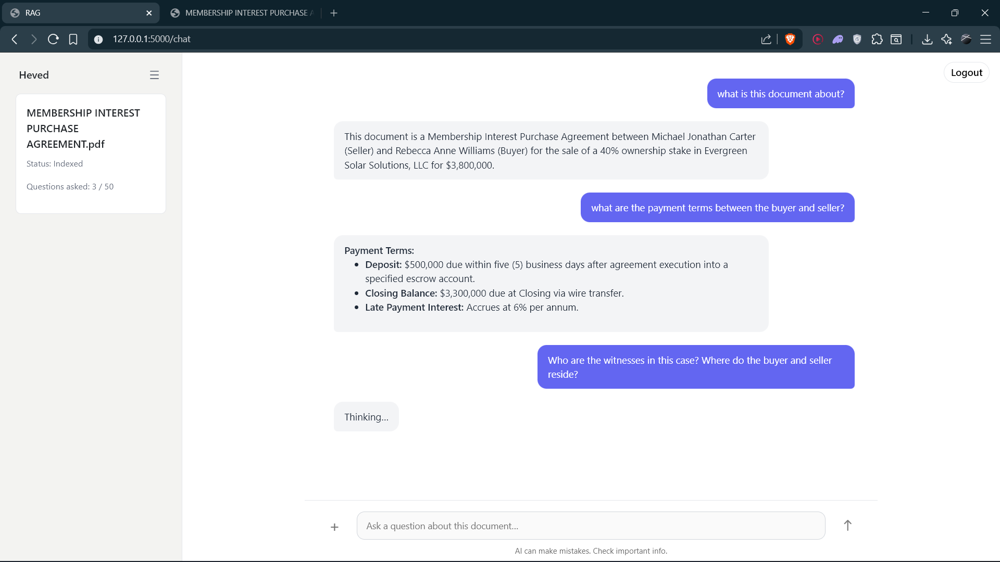

#  RAG Assistant

Production-ready Retrieval Augmented Generation (RAG) system designed to deliver high-precision document intelligence, enabling faster research, structured extraction, and decision support. 

The system is currently fine-tuned for legal workflows but can be adapted to any domain that requires grounded document question-answering.

---

## Demo

## Overview

This project implements an end-to-end document intelligence platform that allows users to:

- Upload and index long-form PDF documents
- Ask natural language questions grounded in document context
- Extract timelines, clauses, objections, citations, and structured legal insights
- Perform semantic + keyword hybrid retrieval
- Authenticate users via Google OAuth
- Persist document metadata and usage via Supabase backend
- Deploy as a scalable web application

The system uses a dynamic retrieval pipeline that adjusts search strategy based on query intent, improving answer accuracy and reducing hallucination.

---

## Business Impact

- Reduces legal research time significantly
- Enables automated due diligence and case summarization
- Improves compliance review efficiency
- Provides scalable document intelligence infrastructure
- Supports domain adaptation for finance, healthcare, insurance, policy, research, and enterprise knowledge bases

---

## Key Capabilities

### Retrieval Intelligence

- Hybrid retrieval architecture:
  - Dense semantic similarity search
  - Maximal Marginal Relevance diversification
  - BM25 keyword ranking
- Ensemble weighted ranking improves recall and precision
- Dynamic query classification adjusts retrieval depth automatically

### Legal-Optimized Prompting

- Timeline reconstruction
- Clause and objection enumeration
- Section reconciliation and missing reference detection
- Confidence tagging based on evidence redundancy
- Pin-cite formatting with page references

### Document Processing

- High-resolution PDF layout parsing using Unstructured
- Title-aware semantic chunking
- Metadata filtering for vector store compatibility

### Model Layer

- LLM inference via DeepSeek chat model
- Easily replaceable with OpenAI, local Ollama, or any OpenRouter-compatible model

### Authentication and Data Layer

- Supabase backend integration:
  - Google OAuth authentication
  - User session management
  - Document tracking and usage limits
  - Database persistence

---

## System Architecture

Frontend  
- Vanilla JS component architecture
- Chat interface for document Q&A
- Upload and authentication views

Backend  
- Flask application entrypoint
- Modular service design:
  - Authentication service
  - Rate limiting
  - Logging
  - RAG pipeline orchestration

Retrieval Stack  
- Chroma vector database
- HuggingFace embedding model  
  `sentence-transformers/all-mpnet-base-v2`
- Ensemble retriever controller

LLM Layer  
- DeepSeek Chat API (configurable)

Infrastructure  
- Environment variable configuration
- Production deployment configuration via Render

---

## Project Structure

    backend/
        auth.py
        limits.py
        logger.py
        rag.py
        supabase_client.py

    frontend/
        components/
        static/
        app.js
        index.html
        supabase.js
    app.py
    requirements.txt
    render.yaml
    runtime.txt
    .env

---

## RAG Pipeline Design

### Query Classification Strategy

Queries are categorized into:

- Factual extraction  
  Small context window, fast retrieval

- Legal analysis  
  Large context window, deep retrieval

- Process / procedural  
  Medium retrieval scope

- General  
  Balanced retrieval

Dynamic `k` tuning improves both latency and answer relevance.

### Retrieval Flow

1. PDF ingestion and layout partitioning  
2. Semantic chunk generation  
3. Metadata normalization  
4. Vector store indexing  
5. Ensemble retrieval at query time  
6. Context assembly  
7. Structured prompt execution & api call to LLM
8. Answer generation

---

##### Developed by: Rishabh Singh

